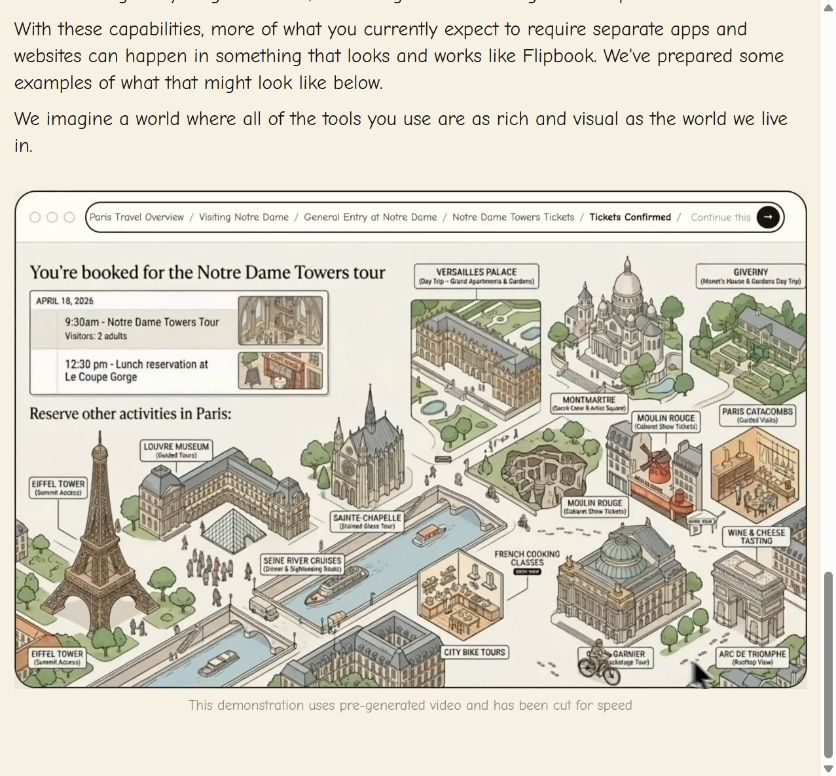

# Flipbook 官方公开演示：样式与由远及近动效分析

研究日期：2026-08-29（Asia/Shanghai，约 22:15–22:21）  
研究对象：[`https://flipbook.page/`](https://flipbook.page/) 的公开首页、公开 DOM/CSS，以及页面公开的 [`ParisExampleVideo.mp4`](https://flipbook.page/ParisExampleVideo.mp4)。  
研究边界：只观察公开内容和下载公开演示视频；没有提交搜索、上传图片、开启付费推理或读取项目密钥。视频中的巴黎示例不是盐田港数据，不能把它当作盐田港事实来源。

> 重要区分：下面的“已确认”来自官方页面文字、当前公开 DOM/CSS 或视频文件元数据；“推测”只根据可见画面归纳，不代表官方后端实现。官方页面明确写着演示视频是预生成并为速度剪辑，因此不能用它证明实时首帧延迟或每次点击都能成功。

## 1. 证据与复现记录

| 证据 | 观察方式 | 当前可复核结果 |
| --- | --- | --- |
| 官网正文 | agent-reach 的 Web/Jina 路由读取 `https://flipbook.page/` | 产品将每个 page 描述为一张按需生成的图片；点击图片内容会继续探索；正文宣称图片页没有 HTML/代码/字段叠加。 |
| 当前首页 DOM | Chrome 浏览器只读快照（CSS viewport 851×790，DPR 1.5） | 搜索框 placeholder 为 `Ask about anything`；GET 表单 action 为站点根路径；有文件上传、清空历史、分享入口；空状态提示要求输入或上传后开始。 |
| 空状态截图 | 浏览器截图 | [01-initial-public.png](assets/flipbook-official/01-initial-public.png) |
| 分享空状态 | 只点击公开的 `Open share menu`，未发送数据 | [05-share-empty.png](assets/flipbook-official/05-share-empty.png)；`Copy current link` 在没有页面时 disabled。 |
| 演示视频上下文 | 浏览器滚动到公开视频区域截图 | [04-demo-page-context.png](assets/flipbook-official/04-demo-page-context.png)；页面同时显示免责声明“预生成并为速度剪辑”。 |
| 演示视频文件 | HTTP GET 下载公开 MP4，再用 ffprobe/ffmpeg 本地抽帧 | H.264、1716×1080、30 fps、432 帧、14.4 s，单视频流；HTTP 响应声明 `Accept-Ranges: bytes`。 |

截图和抽帧的 SHA-256、尺寸、来源 URL 保存在 [`assets/flipbook-official/manifest.json`](assets/flipbook-official/manifest.json)。

### 1.1 当前公开页面的 UI 边界

- 浏览器外壳是可见的 DOM/CSS：2 px 深色边框、约 2 rem 圆角、胶囊形地址/历史栏和圆形提交按钮。当前公开的 [`BrowserWindow CSS`](https://flipbook.page/assets/BrowserWindow-HGbqQzi9.css) 与 [`main CSS`](https://flipbook.page/assets/main-0m5lRKNK.css) 的根变量包括 `--page-background: #f7f1e3`、`--panel-background: #ebe1d1`、`--line-color: #171411`，字体栈以 `Comic Neue` 开头。
- 结果画布的公开 CSS 设定 `object-fit: contain`，静态图片和流视频分别在透明度约 0.18 s 的过渡中切换；流式生成状态还有约 1.8 s 的脉冲提示。这些是前端样式线索（来自当前公开 bundle），不是后端推理延迟。
- 当前空状态可见文字是页面 DOM，而演示画面内部的标题、表格、地图标签属于视频内容。官方 FAQ 所说“文字由图像模型渲染、没有文字叠加”应理解为 page image 的规则；不能据此断言浏览器工具栏也由图像模型生成。

## 2. 代表性截图与时间线帧

抽帧时间是相对于 14.4 s 视频的近似采样点；`demo-*` 是本次评审的 canonical 集，`03-demo-t01s.jpg` 至 `03-demo-t14s.jpg` 是每秒补充样本。视频源和所有 hash 见 manifest。

| 约时间 | 文件 | 画面/层级观察 |
| ---: | --- | --- |
| 0.0 s | [demo-00s-overview-laptop.jpg](assets/flipbook-official/demo-00s-overview-laptop.jpg) | 总览：左侧“picture is worth…”和笔记本，右侧巴黎地标等距图；顶部 breadcrumb 为 `Paris Travel Overview`。 |
| 2.0 s | [demo-02s-notre-dame-approach.jpg](assets/flipbook-official/demo-02s-notre-dame-approach.jpg) | 镜头向 Notre Dame 推近；左侧笔记本被裁出画面，目标建筑变大，周边仍保留河流/地标作空间锚点。 |
| 4.0 s | [demo-04s-notre-dame-map.jpg](assets/flipbook-official/demo-04s-notre-dame-map.jpg) | 中景稳定页 `Visiting the Notre Dame`：左列地图、购票、开放时间、无障碍/着装，右侧为建筑主体。 |
| 6.0 s | [demo-06s-interior-entry.jpg](assets/flipbook-official/demo-06s-interior-entry.jpg) | 进入建筑内部的剖视/透视图；左侧是 `General Entry` 信息表，画面内出现入口、等候、宝藏室等引导牌。 |
| 8.0 s | [demo-08s-interior-close.jpg](assets/flipbook-official/demo-08s-interior-close.jpg) | 更近的内部视角；柱、拱顶、座椅和动线占据画布，仍保留左侧说明栏和右下指南针。 |
| 10.0 s | [demo-10s-towers-ticket.jpg](assets/flipbook-official/demo-10s-towers-ticket.jpg) | `Notre-Dame Towers — Reserve Your Climb`：左侧建筑剖切，右侧为日期、时段、票数、总价和确认步骤。 |
| 12.0 s | [demo-12s-branch-map.jpg](assets/flipbook-official/demo-12s-branch-map.jpg) | 从塔楼页向外拉回；建筑逐渐变小，巴黎街区和其他活动卡片重新出现，部分过渡帧有柔和模糊。 |
| 14.0 s | [demo-14s-confirmed-itinerary.jpg](assets/flipbook-official/demo-14s-confirmed-itinerary.jpg) | `Tickets Confirmed` 分支总览：行程卡片加上多个带短说明的地标标签（Eiffel Tower、Louvre、Versailles 等）。 |

下图是页面上下文截图，不是实时生成结果：



## 3. 由远及近的动效拆解

### 3.1 可见的叙事顺序（事实 + 画面归纳）

1. **总览建立坐标系**：先给出城市/主题的宽幅等距图，同时放少量说明文字和多个可探索地标。
2. **目标锁定**：镜头以 Notre Dame 为视觉锚点推进，笔记本、艾菲尔铁塔和画面边缘的建筑向外移出；河流、桥和树木保留为连续性线索。
3. **区域信息页**：目标变成画面主体，左列信息面板把地图、票务、时间和无障碍信息分组，空间关系仍可读。
4. **建筑内部**：从外部等距图切换为剖视/内部透视，入口、排队和路线用牌子、箭头和指南针解释。
5. **可执行步骤**：再进入塔楼预约页，画面右侧出现按步骤组织的日期/时段/票数/确认信息。
6. **分支回到总览**：确认后镜头拉远，显示多个可继续探索的活动卡片，当前路径仍留在顶部 breadcrumb。

### 3.2 动画机制的谨慎判断

从 1 秒样本可见，阶段之间不只是对同一张位图做简单缩放：侧栏内容、建筑剖切结构和标签集合会重新排版，且中间有淡出、重绘和轻微模糊。因此更合理的**推测**是“目标保持锚定的状态到状态过渡（可能包含图生视频/重绘）”，而不是单纯 CSS zoom。公开视频不能证明它是怎样生成的，也不能测出真实点击后的首帧时间。

画面中反复出现的手形光标属于演示录制中的点击提示；它不应被当作生成图像的风格元素，也不能据此推断产品一定会在每次交互显示光标。

## 4. 视觉语法：给盐田项目的可复用观察

### 4.1 画布与材质

- 温暖的米白/纸张底色，深炭黑或深棕墨线，低饱和鼠尾草绿、灰蓝水面、赭石/珊瑚色作为少量重点。
- 线条有手绘的轻微粗细变化；建筑采用等距或略带鸟瞰的正交关系，阴影很轻，避免写实摄影和高光 3D 渲染。
- 画面留白用于标题、地图和卡片分组；信息密度随尺度增加，而不是一开始把所有标签塞满。
- 官方演示的文字有时模糊或拼写不稳定，和官网 FAQ 对模型文字可能出错的说明一致。不能把生成文字作为可靠数据库字段。

### 4.2 信息层级

| 尺度 | 画面职责 | 典型构图 |
| --- | --- | --- |
| 区域/城市 | 说明“这里有什么、可往哪里走” | 大地图/等距总览 + 少量地标和标题 |
| 地点/建筑 | 解释到达、票务、开放时间和关键入口 | 主建筑占右侧或中央，左列信息卡/小地图 |
| 内部/对象 | 解释路线、功能和下一步操作 | 剖视图、箭头、入口牌、指南针或局部细节 |
| 分支/回退 | 提供下一批可探索节点 | 拉远后的地图 + 多个带短说明的卡片/标签 |

### 4.3 标签与解释的放置

- **画面内标签**：短标题、分组小标题和表格直接嵌入插图；标签通常位于对象旁边或沿引线末端，使用浅色底、深色边框和足够留白。
- **路径提示**：入口/排队/路线使用箭头和小牌子，避免在建筑轮廓上覆盖大块文字。
- **分支标签**：总览页把标签做成小卡片，常带一行括号说明（如活动类型），并以引线或空间邻近关系绑定地标。
- **层级提示**：顶部 breadcrumb 显示父节点 → 当前节点 → `Continue this session`；当前节点加粗，历史节点弱化。这是浏览器外壳的导航，不应和图像内标签混为一谈。
- **可访问性/事实解释**：官网公开 FAQ 采用“纯像素”原则；本项目若需要可复制文本、引用和屏幕阅读器，必须另设辅助层。辅助 DOM 层是工程增强，不应宣称为官网 100% 复刻。

## 5. 对盐田生图与动画工作流的建议（设计输入，不是官方实现证明）

### 5.1 风格合同

每次请求都应带同一份可版本化的 `style_contract`，而不是只写一句“像 Flipbook”：

```yaml
medium: "hand-drawn ink and watercolor travel information illustration on warm paper"
palette: [warm_cream, charcoal_ink, muted_sage, harbor_blue, ochre, coral_accent]
linework: "variable ink contour, restrained hatching, no glossy 3D render"
layout: "isometric/orthographic map with generous paper whitespace"
text: "short, high-contrast labels integrated into the illustration; avoid long paragraphs"
negative: [photorealism, neon UI, glossy gradients, arbitrary floating chips, dense tiny text]
```

颜色名称是语义约束；最终色值和字体应在项目自己的风格参考包中固定并验收。用户提供的参考图可用于盐田项目的风格包，但它们不能证明等同于官方内部模型风格。

### 5.2 尺度层与父子图连续性

建议固定 `region → zone → building → interior/object` 四档 `scale_tier`：

- 每个子图带 `parent_image`、`anchor_bbox`（父图目标区域 0..1 坐标）、`camera_target` 和要保留的 2–3 个环境锚点（例如海岸线、码头主轴、塔吊/仓库轮廓）。
- 从远到近只提高目标细节和信息密度，不改变纸张材质、墨线、调色板和光照方向。
- 从建筑到内部采用“剖切揭示”或“门/入口推进”，同时保留外轮廓的一小部分，防止用户失去方位。
- 回退/分支使用同一锚点做反向拉远，并恢复父节点的标签集合；不要把每一层当成互不相关的新海报。

### 5.3 动画 profile（项目目标值，非官方测量）

在 pipeline 中把过渡类型显式化，例如：

| profile | 建议镜头 | 项目初始目标时长 |
| --- | --- | ---: |
| `overview_to_zone` | 目标中心缓慢推进，边缘地标轻微视差 | 3–5 s |
| `zone_to_building` | 保留道路/水岸锚点，建筑重绘并放大 | 2.5–4 s |
| `building_to_interior` | 入口对齐后剖切揭示，箭头/路线逐步出现 | 3–5 s |
| `return_to_map` | 以当前建筑为中心平滑拉远，展开分支卡片 | 3–5 s |

这些是便于验收的工作流默认值，不是从官方演示反推出的 SLA。应同时保留静态图片和预生成 MP4 fallback；只有测量到增量推理、首帧、取消、重连和 GPU 冷启动后，才可把某条路径称为实时流。

### 5.4 标签双轨策略

用 feature flag 明确两种模式：

1. `pixel_strict`：短标签和解释全部作为图像生成提示的一部分，画布外不叠加 DOM 文本，最大化官网视觉一致性。
2. `assistive`：保留同样的图像标签，同时用结构化 `label_manifest` 提供可复制文本、引用、点击命中区域和屏幕阅读器说明；DOM 标签只在需要时显示。

两种模式共享 `label_id`, `anchor_bbox`, `text`, `parent_node_id` 和 `source_ids`，这样点击解析、预取、历史回退和解释层不会依赖 OCR 结果。图像内文字仍应限制长度，并在生成后做可读性检查。

## 6. 验收与验证建议

不以“看起来像”作为唯一通过条件，至少记录以下可重复指标：

- **连续性**：父/子图锚点在归一化坐标中的漂移、过渡中是否出现突然跳变或目标消失。
- **层级**：四档 `scale_tier` 是否按顺序推进；回退是否回到已有节点而不是无提示地重新生成。
- **标签**：每个标签的 `anchor_bbox` 是否落在对应对象；图像文字可读性和结构化文本是否一致。
- **材质**：纸张底色、墨线密度、重点色比例和留白是否在父子图之间稳定。
- **延迟**：分别记录已缓存节点打开时间、未命中解析时间、静态首帧、视频首帧和最终帧时间；不要用官方预生成 MP4 的播放时长代替实时延迟。
- **降级**：模型/视频不可用时能回到最后一张静态图，并保留 breadcrumb、历史和解释数据。

本次验证命令/动作：

```text
agent-reach doctor --json                  # 确认网页路由可用
curl https://r.jina.ai/https://flipbook.page/ # 读取公开正文
ffprobe -v error .../ParisExampleVideo.mp4  # 核对公开视频元数据
Get-FileHash -Algorithm SHA256 docs/research/assets/flipbook-official/*
```

没有执行任何搜索提交、图片上传或百炼调用。下次复核时应重新获取页面和视频，因为公开 bundle、演示资源和 waitroom 状态可能变化。

## 7. 已确认、推测与暂时无法验证

### 已确认

- 官网公开文字把 Flipbook 描述为按需生成的无限视觉浏览器；点击图片内容会进入更深一层图片。
- 官网 FAQ 声明 page image 内的文字由图像模型渲染、没有额外文字叠加，并提醒文字可能错位或出错。
- 官网把 live video stream 标为实验性、资源密集且行为可能不可预测；公开演示声明使用预生成视频并为速度剪辑。
- 当前公开 DOM 有搜索、上传、历史清除和分享入口；空状态不显示默认主题。
- 公开 MP4 的文件和编码元数据如第 1 节所列，截图和 hash 可由 manifest 复核。

### 推测（仅供设计）

- 画面阶段之间可能使用目标锚定的 morph/crossfade、重绘或图生视频组合，而非单一 CSS 缩放。
- 为维持“点击任意处”的可理解性，生产系统很可能需要父子锚点、候选预热和已有节点回放；这是工程推理，不是官网后端证明。
- 盐田项目最稳妥的复刻方式是把风格合同、尺度层、标签 manifest 和过渡 profile 作为请求的一等字段。

### 暂时无法验证/不应承诺

- 官方后端源码、模型型号、GPU 规格、真实实时队列、缓存命中率和 SLA。
- 预生成 Paris 视频在真实用户点击下的首帧时间、帧率、每次连续性和失败率。
- 用户提供的盐田参考图与官方内部模型风格完全相同，或国产模型已经达到相同的文字/建筑连续性质量。
