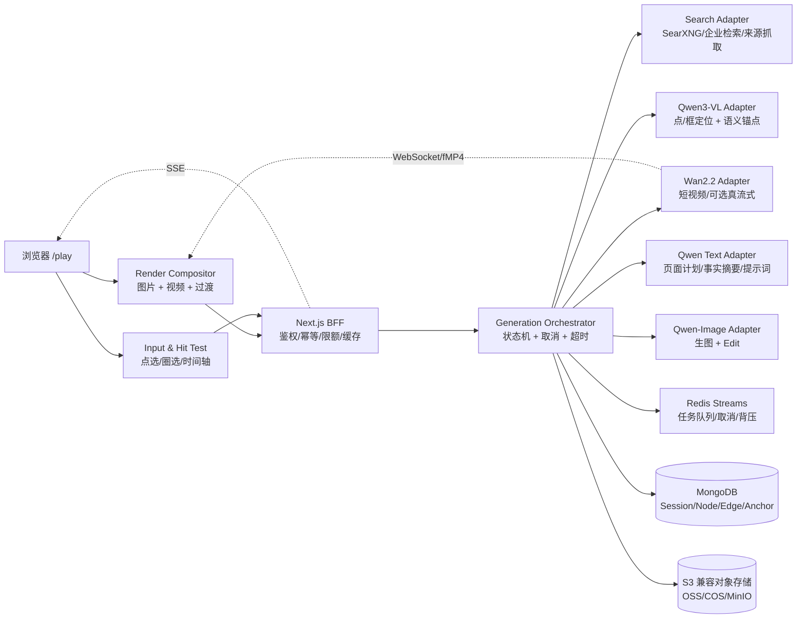

# 盐田 Flipbook：国产模型驱动的无限视觉浏览架构

> 版本：v0.1（方案稿）  
> 日期：2026-08-28  
> 状态：可进入 PoC 评审，尚未代表已完成实现或真实模型压测

一手来源核验记录见 [`docs/research/flipbook-source-notes-2026-08-28.md`](./docs/research/flipbook-source-notes-2026-08-28.md)。

## 1. 先校正目标

本方案借鉴两个不同性质的对象：

- `flipbook.page` 是产品体验参照。官网把它描述为“按需生成的无限视觉浏览器”，每个页面是图片，点击图片区域后继续探索；它同时明确说明 live video stream 仍是实验功能、资源消耗高且行为不可预测，演示视频是预生成并为速度剪辑过的。
- `eren23/openflipbook` 是 MIT 许可的社区实现。它已经把点击解析、页面规划、图片生成、SSE、节点图、预取和可选视频链路拆成可借鉴的模块，但其 LTX worker 当前仍是“先生成完整 MP4，再拆成 init/media 两段发送”的功能性脚手架，不是真正的逐帧推理流。

因此，“百分之百达到演示动画效果”不是一个可直接承诺的工程目标。必须拆为三个可验收目标：

1. **视觉等价**：画面占满、无默认 HTML 内容覆盖、点击后保持主体/风格/镜头连续、过渡节奏与演示相近。
2. **交互等价**：历史节点和已缓存候选可以立即跳转；点击未生成区域时，先给即时反馈，再异步得到新页面。
3. **性能目标**：以 p50/p95 和明确的测试设备、网络、模型版本为准，而不是以“实时”这个模糊词为准。

本方案的核心反驳是：**如果把每次点击都绑定到一次新的视频扩散推理，最低延迟与成本、稳定性无法同时成立。** 首次响应必须走本地缓存或客户端过渡；视频生成是可取消、可降级的后台派生资源。

## 2. 范围与非目标

### 2.1 本期范围

- 文本查询或上传图片作为根节点。
- 一张主画面作为主要 UI；点击、拖拽圈选、键盘/时间轴作为导航输入。
- 国产模型完成视觉定位、结构化规划、图片生成/编辑和视频生成。
- 每个画面带结构化语义锚点：名称、类别、框/点坐标、解释、来源。
- 节点图持久化，支持返回、分享、继续探索和零模型调用的已生成页面打开。
- 三级动画：即时视觉过渡、短视频增强、可选真流式视频。

### 2.2 非目标

- 不复制 `flipbook.page` 的私有代码、未公开资产、内部接口或品牌。
- 不把“图片内文字”当作可靠数据库字段。图片文字是渲染结果，结构化标签必须另存。
- 不在第一阶段承诺 1080p/24fps 的端到端实时生成；这需要单独的 GPU、模型和网络基准。
- 不把来源检索、模型推理、业务权限混在浏览器端。

## 3. 体验契约

### 3.1 用户看到的状态机

```text
READY
  ├─ 命中已有边/缓存 ───────────────> LOCAL_TRANSITION ─> READY
  ├─ 点击新区域 ─> ACKNOWLEDGED ─> RESOLVING ─> PLANNING
  │                                  └──────────────> FAILED/RETRY
  └─ 预取候选 ─> PREFETCHING（不阻塞当前画面）

PLANNING ─> DRAFT_READY ─> IMAGE_READY ─> VIDEO_ENHANCING ─> READY
                              └──────────────> FAILED（保留草稿或旧画面）
```

### 3.2 延迟预算（目标，不是已测事实）

| 场景 | 目标 p50 | 目标 p95 | 说明 |
|---|---:|---:|---|
| 已有节点/候选本地跳转 | 50 ms | 200 ms | 不调用模型；只做资源切换和过渡 |
| 点击视觉反馈 | 16 ms | 50 ms | 涟漪、焦点框、忙碌态在浏览器本地完成 |
| 首个 SSE 状态事件 | 300 ms | 1,000 ms | BFF 已建立连接并返回阶段 |
| 新页面草稿可见 | 2 s | 4 s | 低分辨率/低成本图片，可被最终图替换 |
| 新页面最终图 | 8 s | 25 s | 受国产图片模型、队列和网络影响 |
| 已预生成视频开始播放 | 300 ms | 1,500 ms | CDN/对象存储命中；不是现场生成时间 |
| 真流式暖实例首个可解码片段 | 1 s | 2 s | 需要专用 GPU worker；冷启动另列 |
| 标签/解释命中缓存 | 30 ms | 100 ms | 直接读语义锚点；不重复 VLM |

验收必须记录：模型版本、量化方式、GPU 型号、并发、输入尺寸、网络 RTT、缓存命中率和是否暖实例。没有这些条件，单独报一个“延迟”没有比较意义。

## 4. 总体架构



### 4.1 模块职责与 seam

这里把可替换的远程依赖放在 seam 上；业务逻辑只依赖小接口，生产和测试分别使用不同 adapter。

| 深模块 | 小接口 | 生产 adapter | 测试 adapter |
|---|---|---|---|
| `GenerationOrchestrator` | `start(input) -> EventStream`、`cancel(jobId)`、`resume(jobId)` | FastAPI + Redis Streams | 内存事件流 |
| `VisualResolver` | `resolve(imageRef, point/stroke) -> Anchor` | Qwen3-VL 服务 | 固定坐标 fixture |
| `PagePlanner` | `plan(context) -> PagePlan` | Qwen 文本模型 | 确定性 JSON planner |
| `ImageRenderer` | `render(plan, refs) -> RenderAsset`、`edit(...)` | Qwen-Image/ModelScope 服务 | 固定 JPEG |
| `MotionRenderer` | `animate(start, end, motion) -> MotionAsset` | Wan2.2 GPU worker | 固定 fMP4 |
| `SourceResolver` | `search(query) -> Citation[]` | SearXNG/企业搜索/抓取 | 固定来源集 |
| `AssetStore` | `put/get/presign` | OSS/COS/S3/MinIO | 临时目录 |
| `WorldRepository` | `load/save/appendEdge` | MongoDB | 内存仓库 |

不要把每个函数都做成远程服务；真正变化的是模型、存储和部署 adapter，状态机与领域规则应留在一个可测试的深模块中。

## 5. 核心领域模型

### 5.1 术语

- **Session（探索会话）**：一次可继续、可分享、可分叉的探索上下文。
- **SceneNode（场景节点）**：一个稳定的视觉页面及其生成收据。
- **Edge（探索边）**：从父节点某个语义锚点到子节点的导航关系，包含坐标和动作类型。
- **SemanticAnchor（语义锚点）**：画面中的可解释对象，包含 `bbox`/`point`、名称、类别和置信度。
- **RenderAsset（画面资源）**：静态图片、草稿、缩略图或最终图片；不是节点本身。
- **MotionAsset（动效资源）**：由一个或两个 RenderAsset 派生的短视频或 fMP4 片段。
- **Explanation（标签解释）**：展示给用户的简短解释、事实和引用；不直接改写图片像素。
- **ModelReceipt（模型收据）**：模型名、版本、参数摘要、耗时、成本、失败/降级记录。

### 5.2 节点最小形状


```json
{
  "id": "node_01",
  "session_id": "sess_01",
  "parent_id": null,
  "relation": "root|tap|zoom|ascend|edit",
  "query": "盐田港的潮汐与航运",
  "scale_tier": "region|place|object",
  "style_anchor": {"palette": [], "medium": "illustrated_map", "seed": 42},
  "render": {
    "draft_url": "...",
    "image_url": "...",
    "width": 1280,
    "height": 720,
    "sha256": "..."
  },
  "anchors": [
    {
      "id": "anchor_07",
      "label": "盐田港集装箱码头",
      "kind": "place",
      "bbox": {"x": 0.42, "y": 0.28, "w": 0.21, "h": 0.16},
      "explanation": "...",
      "citations": ["https://..."]
    }
  ],
  "model_receipts": [],
  "created_at": "2026-08-28T00:00:00Z"
}
```

坐标统一为原图归一化坐标，浏览器负责处理 letterbox、device pixel ratio 和旋转；VLM 不接收浏览器 CSS 坐标。

## 6. 端到端数据流

### 6.1 首次查询

1. 浏览器创建 `Session`，发送查询和视口比例。
2. BFF 校验会话所有权、幂等键和预算；不把模型密钥下发浏览器。
3. `SourceResolver` 拉取来源，保留 URL、抓取时间和摘要片段。
4. `PagePlanner` 输出严格 JSON：标题、视觉媒介、镜头、实体清单、图片提示词、引用。
5. `ImageRenderer` 并行生成草稿和最终图；先返回可见草稿，最终图替换但不改变节点 ID。
6. `VisualResolver` 对最终图生成语义锚点，写入节点和空间索引。
7. 浏览器绘制主画面；默认不叠加 HTML 文本，标签解释在 hover/focus 时从锚点数据读取。

### 6.2 点击新区域

1. 浏览器立即显示点击焦点，并把 CSS 坐标归一化；若命中本地锚点，直接复用 `anchor_id`。
2. 若命中已有 `Edge`，只做本地过渡并切换到子节点。
3. 若没有锚点或置信度不足，发送压缩后的原图/标注图给 Qwen3-VL；服务端返回点/框、对象名、动作类型和置信度。
4. `PagePlanner` 结合父节点、风格锚点、尺度梯级和来源生成下一页计划。
5. 编排器先发 `status`，再发 `draft`/`final`；任何阶段收到断开或取消都停止后续付费调用。
6. `MotionRenderer` 在最终图落盘后异步生成短视频；视频失败不影响静态页面。
7. 事务性写入 `SceneNode + Edge + ModelReceipt`，之后才把边标记为可复用。

### 6.3 任意跳转

“任意跳转”应分成两类：

- **已知跳转**：时间轴、历史、分享链接、已生成候选。只读节点图和对象存储，目标是 200 ms p95 内完成。
- **未知跳转**：用户在当前图上点击了尚未生成的对象。它本质上是一次新推理，不能承诺零延迟；体验上用即时过渡、草稿和取消机制隐藏等待。

## 7. 标签与解释设计

### 7.1 默认显示策略

严格复刻模式下，画面内文字仍由图片模型绘制，浏览器不在画面上加永久 DOM 标签。为了满足“标签解释”而又不破坏画面，采用三层：

1. **像素层**：Qwen-Image 根据提示词绘制标题、图例或地名；它可能出现错字，不能作为结构化事实。
2. **语义层**：透明 hit map 保存锚点，hover/focus 时显示轻量解释浮层；这是交互辅助，不参与主画面排版。
3. **事实层**：侧栏或详情面板显示来源、时间、置信度和“模型生成/来源检索”标记。

如果验收要求“任何时刻都没有 HTML”，则把第 2、3 层关闭，改为生成图内标签；这会牺牲可访问性、可搜索性和事实纠错能力，不能同时拥有两者。

### 7.2 解释数据规则

- VLM 只负责“哪里、是什么、置信度”；不让它凭空补事实。
- 事实解释必须引用检索来源或明确标注为模型知识。
- 置信度低于阈值时显示“可能是……”并允许用户重试，不伪装成确定答案。
- 标签响应可缓存，缓存键为 `node_sha + anchor_id + locale`。

## 8. 国产模型矩阵

### 8.1 推荐首选

| 能力 | 首选 | 备选/降级 | 采用理由与边界 |
|---|---|---|---|
| 点选定位、框/点 grounding、OCR | Qwen3-VL-8B/32B Instruct | Qwen3-VL-4B/2B | 官方仓库明确提供 2D 点/框 grounding、OCR、视频理解和 vLLM/SGLang 部署；8B 做低延迟，32B 做质量臂，需用项目数据集实测 |
| 页面计划、事实整理 | Qwen3 系列文本模型 | 本地 Qwen 小规格 | 结构化 JSON 和中文提示词由编排器约束；检索由独立 adapter 提供，不依赖某一家模型的联网插件 |
| 首屏生图 | Qwen-Image-2512 | Qwen-Image-Lightning/量化版本 | 官方仓库强调中文文字渲染、2K 和编辑能力；Lightning 的加速宣传不能直接当作本项目延迟承诺 |
| 进入/编辑/保持风格 | Qwen-Image-Edit-2511 | Qwen-Image-Edit-2509 | 走 edit 接口并传父图、裁剪区和风格收据，避免“接受参考图但实际忽略”造成场景漂移 |
| 动效增强 | Wan2.2 TI2V-5B | Wan2.2 I2V-A14B、LightX2V 加速 | 官方支持 720P/24fps；README 同时说明 TI2V-5B 未专项优化时单张消费级 GPU 生成 5 秒视频接近 9 分钟，因此只能后台派生，不能阻塞点选 |

### 8.2 模型路由规则

```text
fast:   Qwen3-VL-8B + Qwen-Image-Lightning/低步数 + 无现场视频
balanced: Qwen3-VL-32B + Qwen-Image-2512/Edit + Wan2.2-TI2V-5B 异步
quality: Qwen3-VL-32B/更大规格 + Qwen-Image-Edit + Wan2.2-I2V-A14B
```

同一逻辑请求必须记录实际命中的模型；失败降级只允许发生在语义能力兼容的链路上，不能用不支持参考图的生图模型替代 edit 链路。

## 9. 动态画面实现

### 9.1 三级策略

**Tier A：即时视觉过渡（默认）**

- 当前图片在浏览器中做 scale/translate、轻微视差、模糊和颜色过渡。
- 旧画面始终可回退；点击反馈不等待网络。
- 这不是模型生成视频，但能把“点击后停住”的感知延迟降到本地帧级。

**Tier B：后台短视频增强（推荐生产默认）**

- 新旧画面确定后，Wan2.2 生成 2--5 秒 I2V/TI2V 片段。
- 片段存对象存储，按 `start_sha + end_sha + motion_profile + model_version` 去重。
- 浏览器在片段 ready 后无缝替换 Tier A 过渡；失败只记录收据，不阻塞页面。

**Tier C：真流式（实验开关）**

- GPU worker 以 WebSocket 发送 init segment、连续 fMP4 media segment 和 sequence；浏览器用 MSE 播放。
- 协议必须支持 `start/stop/resume(position)`、Origin 校验、会话鉴权、背压、超时和取消。
- 推理循环必须在生成片段时就输出，而不是把完整 MP4 生成完再发送；否则只是分段传输，不会降低 time-to-first-frame。
- 冷启动、GPU 排队和模型加载时间必须单独显示，不能混入“暖实例实时”指标。

### 9.2 浏览器合成器

```text
RenderCompositor
  ├─ ImageSurface：草稿/最终图，预解码和双缓冲
  ├─ VideoSurface：MSE/fMP4 或 MP4 fallback
  ├─ TransitionClock：按 monotonic clock 驱动，支持 seek/cancel
  ├─ HitMap：归一化坐标到 anchor/edge 的索引
  └─ AccessibilitySurface：可选的解释面板，不覆盖主画面
```

优先使用浏览器原生 ``/`<video>` 加合成层，只有在需要多图层视差和细粒度 shader 时才引入 WebGL；不要为了“看起来高级”把所有内容搬进 3D 引擎。

## 10. 接口草案

### 10.1 生成 SSE

`POST /v1/sessions/{sessionId}/generate`

请求最小字段：

```json
{
  "query": "盐田港的潮汐与航运",
  "parent_node_id": "node_01",
  "anchor_id": "anchor_07",
  "point": {"x": 0.51, "y": 0.36},
  "mode": "tap|edit|ascend",
  "image_tier": "fast|balanced|quality",
  "video": "off|async|stream",
  "idempotency_key": "..."
}
```

事件顺序：

```text
status(received)
status(resolving)
anchor(resolved)
status(planning)
plan(ready)
draft(asset)
status(rendering)
final(node + asset + anchors)
motion(queued|ready|failed)       # 异步视频，可晚于 final
error(code, retryable, trace_id)  # 终止事件
```

### 10.2 真流式 WebSocket

`GET /v1/sessions/{sessionId}/stream`

```json
{"action":"start","job_id":"job_01","start_asset":"...","prompt":"...","position":0}
{"action":"stop","job_id":"job_01"}
{"action":"resume","job_id":"job_01","position":12}
```

二进制帧必须包含 `session_id`、`job_id`、`sequence`、`is_init_segment`、`final` 和 `content_type`。服务端只保证幂等 sequence，不保证断线后从显存恢复；恢复策略是从最近 checkpoint 或重新生成。

### 10.3 标签解释

`GET /v1/nodes/{nodeId}/anchors/{anchorId}?locale=zh-CN`

返回 `label`、`kind`、`bbox/point`、`summary`、`facts[]`、`citations[]`、`confidence`、`generated_at` 和 `model_receipt_id`。该接口必须是只读和可缓存的。

## 11. 缓存、预取与成本控制

- **打开已存在页面零模型调用**：节点只引用对象存储地址和语义数据；BFF 不自动重新生成。
- **候选预取**：当前页面 ready 后，后台最多预取 3 个高置信锚点；hover debounce 300 ms，离开页面立即取消低优先级任务。
- **幂等**：`session_id + parent_node_id + anchor_id + prompt_hash + model_profile` 生成任务唯一化。
- **分层缓存**：浏览器内存 -> CDN/对象存储 -> Redis 热索引 -> Mongo 节点图；缓存命中必须记录。
- **预算闸门**：每会话、每用户、全局日预算分别校验；预取消耗独立计量，不能把“用户没有点击”当作免费。
- **取消优先级**：用户新点击 > 当前草稿 > 视频增强 > 低置信预取。

## 12. 部署建议

### 12.1 PoC

```text
web/BFF           1 个 CPU 容器
orchestrator      1 个 FastAPI 容器
worker            1 个 GPU 容器（先 VLM + image，视频单独开关）
MongoDB           1 个容器
Redis             1 个容器
MinIO             1 个容器
SearXNG           1 个容器或企业检索服务
```

先用 Docker Compose 固化环境和端口；模型服务通过 OpenAI-compatible adapter 或 ModelScope/DashScope adapter 接入。不要在同一个 GPU 上同时默认加载大 VLM、图片扩散和视频扩散，除非压测证明显存、队列和尾延迟可接受。

### 12.2 生产

- Web/BFF、编排器、VLM GPU 池、图片 GPU 池、视频 GPU 池分开扩缩。
- 对象存储使用 OSS/COS/S3 兼容接口，外链使用短期签名 URL。
- Redis Streams 负责队列、取消和背压；Mongo 保存节点图、收据和空间索引。
- 统一 `trace_id`，记录每个阶段的开始/结束、命中模型、输入尺寸、token、GPU 队列、缓存和降级原因。
- 所有模型密钥只存在服务端 secret；上传图片设置大小、类型、病毒扫描、内容安全和保留期限。

## 13. 验收与测试

### 13.1 免费确定性测试

- TS/Pydantic/JSON Schema 字段完全一致。
- 坐标归一化、letterbox、框/点转换的属性测试和跨语言 golden。
- 节点图事务：重复幂等键不重复扣费、不产生重复边。
- 断开、取消、超时、重试、降级和 sequence 去重。
- 320 px、390 px、桌面宽屏的点击区域、标签浮层和视频层不溢出。

### 13.2 付费/模型评测

- `click_grounding_accuracy`：命中正确对象的比例，按大/中/小目标分层。
- `anchor_explanation_factuality`：引用可追溯率和人工抽检准确率。
- `scene_continuity`：主体、布局、风格、镜头变化的人工/模型双评。
- `motion_temporal_consistency`：首尾帧贴合、闪烁、主体漂移、可播放率。
- 延迟报告：TTFI、首状态、草稿、最终图、视频 ready 的 p50/p95/p99。
- 成本报告：每次新节点、每次预取、每个视频片段和失败重试的实际成本。

### 13.3 Definition of Done

只有同时满足以下条件，才可以对外说“达到演示体验目标”：

1. 固定素材集上视觉连续性和点击 grounding 达到预先约定阈值。
2. 已生成节点的跳转达到 200 ms p95，且打开分享链接不触发模型调用。
3. 新点击在 1 s p95 内有状态反馈，在 4 s p95 内有草稿或明确可解释的排队态。
4. 视频失败不会破坏静态页面；真流式开关关闭时系统仍完整可用。
5. 连续 100 次点击压测无重复节点、内存泄漏、未取消的付费任务和不可恢复的 SSE/WS 状态。

## 14. 分阶段交付

| 阶段 | 交付 | 退出条件 |
|---|---|---|
| P0 合同与数据集 | 领域模型、事件协议、20 个中文场景、标注锚点 | schema、坐标和评测脚本冻结 |
| P1 静态无限画布 | 查询、点击、Qwen3-VL、Qwen-Image、节点图、SSE | 新节点闭环成功，断开可取消 |
| P2 标签与即时跳转 | hit map、解释面板、历史/时间轴、候选预取 | 缓存跳转 200 ms p95，标签命中 95%+ |
| P3 动效增强 | 浏览器过渡、Wan2.2 异步视频、CDN 缓存 | 视频失败不影响静态；ready 资源无缝替换 |
| P4 真流式实验 | 增量推理、fMP4、WS 背压/取消/恢复 | 暖实例首片段 2 s p95，明确冷启动提示 |
| P5 质量与上线 | 评测基线、预算、审计、灰度、回滚 | 连续压测和人工体验评审通过 |

## 15. 已确认事实、推测与暂时未知

### 已确认事实

- `flipbook.page` 官方页面把每个页面描述为图片、点击后继续探索；live video stream 是实验功能，演示视频使用预生成素材并为速度剪辑。
- `eren23/openflipbook` 当前主分支是 MIT；仓库结构包含 Next.js web、FastAPI/Modal backend、共享配置、Mongo/R2 以及可选 LTX 视频 worker。
- openflipbook 的前端/后端主闭环是点击解析 -> 页面规划 -> 图片生成 -> SSE -> 节点图持久化；其仓库文档把预取、世界模式和视频路径列为现有能力。
- Qwen3-VL 官方仓库提供 2D 点/框 grounding、OCR、视频理解，并建议使用 vLLM/SGLang 进行服务化；仓库和 Qwen-Image、Wan2.2 仓库的许可证元数据均为 Apache-2.0。
- Qwen-Image 官方仓库强调中文文字渲染和编辑；Wan2.2 官方仓库列出 720P/24fps 能力，并说明 TI2V-5B 未专项优化时 5 秒视频在单张消费级 GPU 上接近 9 分钟。

### 合理推测

- Qwen3-VL-8B/32B、Qwen-Image-2512/Edit-2511、Wan2.2 TI2V-5B 能组成国产模型 PoC 的较短路径。
- 用客户端过渡隐藏模型等待，比把每次点击强制变成视频推理，更可能达到“最低感知延迟”。
- 语义锚点单独存储可以同时满足视觉纯净、标签解释、可访问性和可回溯引用。

### 暂时无法验证

- 在你的目标硬件、并发、网络和国产模型服务配额下，是否能达到本文件的 p50/p95 数字。
- 国产图片模型对特定盐田场景的地理准确性、中文地图文字稳定性和跨节点连续性。
- Wan2.2 增量推理、fMP4 分片和真实首帧时间在目标部署中的结果。

## 16. 来源与许可记录

以下链接是本方案写作时读取的原始来源；动态页面和模型仓库会变化，落地前应重新核对版本、价格、服务条款和权重许可。

1. [flipbook.page 官方页面](https://flipbook.page/)：产品说明、live video stream 说明、预生成演示视频声明（核验日期 2026-08-28）。
2. [openflipbook README](https://github.com/eren23/openflipbook/blob/70d6478f2371d33ddac797dc02d2a8c8e0735149/README.md)：产品定位、点击闭环、预取、视频和 MIT 许可说明。
3. [openflipbook ARCHITECTURE.md](https://github.com/eren23/openflipbook/blob/70d6478f2371d33ddac797dc02d2a8c8e0735149/docs/ARCHITECTURE.md)：web/BFF、SSE、节点图、模块职责和测试层次。
4. [openflipbook STORY.md](https://github.com/eren23/openflipbook/blob/70d6478f2371d33ddac797dc02d2a8c8e0735149/docs/STORY.md)：静态图片与可选视频的事实边界、LTXF/MSE 背景。
5. [openflipbook ltx_stream.py](https://github.com/eren23/openflipbook/blob/70d6478f2371d33ddac797dc02d2a8c8e0735149/apps/modal-backend/ltx_stream.py)：当前先完整生成 MP4 再拆段发送的实现状态。
6. [openflipbook LICENSE](https://github.com/eren23/openflipbook/blob/70d6478f2371d33ddac797dc02d2a8c8e0735149/LICENSE)：MIT 文本。可以借鉴代码结构，但仍需保留许可声明并自行完成合规审查。
7. [QwenLM/Qwen3-VL README](https://github.com/QwenLM/Qwen3-VL/blob/96588727e44c78b25ba03ea03b8e12f7e64fd0da/README.md)：grounding、OCR、部署和版本矩阵。
8. [QwenLM/Qwen3-VL LICENSE](https://github.com/QwenLM/Qwen3-VL/blob/96588727e44c78b25ba03ea03b8e12f7e64fd0da/LICENSE)：Apache-2.0。
9. [QwenLM/Qwen-Image README](https://github.com/QwenLM/Qwen-Image/blob/6b5e1f5cec987d404be5ac6657db3b9aacb56a89/README.md)：中文文字渲染、编辑、Lightning 和部署说明。
10. [QwenLM/Qwen-Image LICENSE](https://github.com/QwenLM/Qwen-Image/blob/6b5e1f5cec987d404be5ac6657db3b9aacb56a89/LICENSE)：Apache-2.0。
11. [Wan-Video/Wan2.2 README](https://github.com/Wan-Video/Wan2.2/blob/42bf4cfaa384bc21833865abc2f9e6c0e67233dc/README.md)：TI2V/I2V、720P/24fps、显存/耗时和 ModelScope 下载说明。
12. [Wan-Video/Wan2.2 LICENSE.txt](https://github.com/Wan-Video/Wan2.2/blob/42bf4cfaa384bc21833865abc2f9e6c0e67233dc/LICENSE.txt)：Apache-2.0 及生成内容责任条款。

模型仓库的开源许可证不等于模型服务条款、训练数据权利或生成内容合规已经自动满足；商业上线前仍需逐个核对服务商合同、内容安全、隐私和备案要求。
